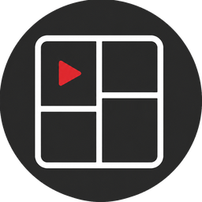

<div align="center">
  
  <h1>LenTalk · 分镜助手</h1>
  <p>基于无限画布的 AI 分镜工作台 —— 一站式完成图片生成、分镜规划、3D 预演与素材管理</p>

  <p>
    <a href="https://github.com/jownda/LenTalk-Copilot/releases/latest">
      
    </a>
    
    
  </p>
</div>

---

## ✨ 核心特性

| | 功能 | 说明 |
|---|------|------|
| 🎨 | **AI 图像生成** | 节点式画布，多模型提供商接入，生成后可继续编辑 |
| 🖼️ | **无限画布** | 自由布局分镜节点、连线组织叙事流，支持缩放平移与框选 |
| 🎬 | **3D 导演台** | 内置人体素体、姿势系统、摄像机与几何体，在 3D 空间预演分镜 |
| 📚 | **素材库** | 图片 / 视频 / 音频分类管理，支持拖拽入画布、智能分类与 zip 备份恢复 |
| 💡 | **提示词库** | 沉淀常用提示词，一键应用到生成节点 |
| 🗂️ | **项目管理** | 多项目隔离，独立保存与切换 |
| 🌗 | **主题与多语言** | 暗色 / 亮色主题，中英双语切换 |
| ⌨️ | **快捷键系统** | 高频操作全键盘可达，可自定义 |

## 📥 下载安装

<div align="center">

| 平台 | 安装包 | 说明 |
|------|--------|------|
| **Windows** | `.exe`（NSIS 安装包） | 双击安装，建议安装 [WebView2 运行时](https://developer.microsoft.com/zh-cn/microsoft-edge/webview2) |
| **Windows** | `.msi` | 企业批量分发用 |
| **macOS** | `.dmg` | 双击挂载，拖入「应用程序」安装 |

👉 **[前往 Releases 下载最新版本](https://github.com/jownda/LenTalk-Copilot/releases/latest)**

</div>

> macOS 首次打开若提示"无法验证开发者"，请在应用上右键 → 打开 → 仍要打开。

## 🛠️ 本地开发

需要环境：**Node.js 20+**、**Rust（stable）**、Tauri 系统依赖（macOS: Xcode CLT / Windows: VS Build Tools + WebView2）

```bash
# 安装依赖
npm install

# 启动开发模式（热更新）
npm run dev

# 桌面端开发运行（Tauri）
npm run tauri dev
```

## 📦 打包构建

```bash
# 类型检查 + 前端构建
npm run build

# 打桌面安装包（当前平台）
npm run tauri build
```

产物位置：
- macOS：`src-tauri/target/release/bundle/dmg/`
- Windows：`src-tauri/target/release/bundle/nsis/` 与 `bundle/wix/`

> 仓库已配置 [GitHub Actions](./.github/workflows/build-releases.yml)：推送 `v*` 标签或手动触发，自动在 Windows / macOS 云构建并发布安装包到 Releases。

## 🧰 技术栈

<div align="center">

[](https://tauri.app) [](https://react.dev) [](https://www.typescriptlang.org) [](https://vitejs.dev) [](https://threejs.org) [](https://github.com/pmndrs/zustand)

</div>

- **桌面框架**：Tauri 2（Rust 后端 + WebView 前端）
- **前端**：React 18 + TypeScript + Vite
- **画布**：React Flow / Konva
- **3D**：Three.js + @react-three/fiber
- **状态**：Zustand + TanStack Query
- **国际化**：i18next（中 / 英）

## 📄 关于

LenTalk 是个人项目，从开源分镜工具 **Storyboard-Copilot** 演进而来，按需持续迭代中。欢迎提 Issue 反馈问题或建议。
